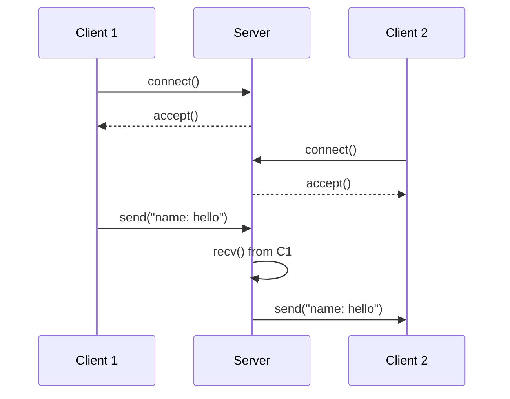

# Architecture & Flow (LLD + Diagrams)

## High-level architecture
- **Client(s)** connect to **Server** over TCP.
- Each client runs two threads:
  - Sender thread: reads from console, sends to server.
  - Receiver thread: listens for broadcasts from server.
- Server accepts connections and starts **one thread per client**.

## Connection + messaging flow
### Server flow
1. `WSAStartup()`
2. `socket(AF_INET, SOCK_STREAM, 0)`
3. `bind(INADDR_ANY, port 12345)`
4. `listen(SOMAXCONN)`
5. Loop:
   - `accept()` new client
   - add socket to `clients` vector
   - `std::thread(InteractWithClient, ...)` + `detach()`

### Client flow
1. `WSAStartup()`
2. `socket()`
3. `connect(127.0.0.1:12345)`
4. Start threads:
   - `SendMsg()`
   - `ReceiveMsg()`

## Mermaid diagrams

### Sequence: connect and broadcast


### LLD: responsibilities
```mermaid
flowchart TD
  subgraph Server
    A[Initialize: WSAStartup] --> B[Create socket]
    B --> C[bind + listen]
    C --> D{accept loop}
    D --> E[Add client socket to vector]
    E --> F[Thread: InteractWithClient]
    F --> G[recv loop]
    G --> H[Broadcast to other clients]
    G --> I[On disconnect: erase socket + closesocket]
  end

  subgraph Client
    J[Initialize: WSAStartup] --> K[Create socket]
    K --> L[connect to 127.0.0.1:12345]
    L --> M[Thread: SendMsg]
    L --> N[Thread: ReceiveMsg]
    M --> O[send "username: msg"]
    N --> P[recv + print]
  end
```

## Notes for explanation (good for interview)
- Server is a **broadcast hub**: it doesn’t interpret messages, it forwards them.
- Client uses **full-duplex** TCP: can send and receive simultaneously via threads.
- Message format is plain text; server forwards bytes as-is.
